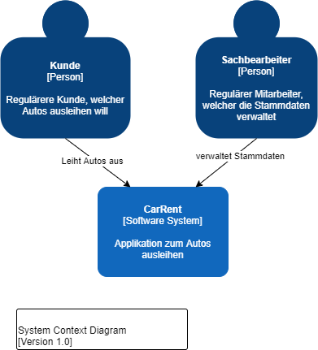
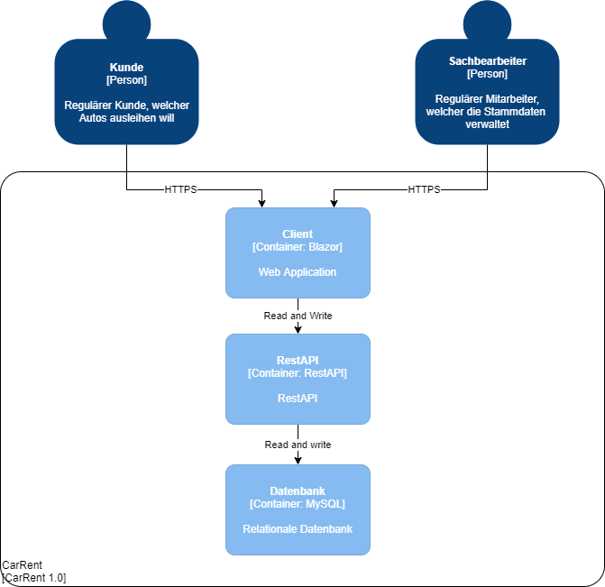
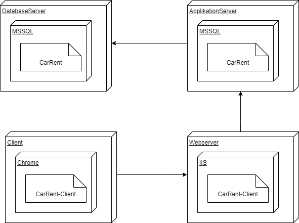
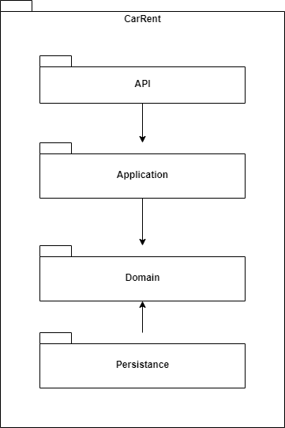
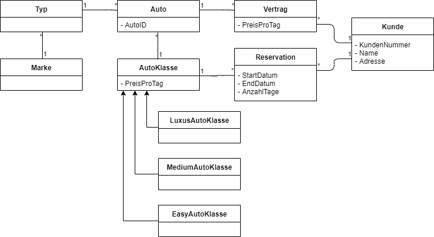

# My Diagrams
 
## Arbeitspaket 1 - Big Picture
### C4-Context

### C4-Containers

### C4-Components

## Arbeitspaket 2 - Domain Model und Use Cases
### Domainmodel

### Use Cases
-	Der Sachbearbeiter kann Kunden mit Namen und Adresse und Kundennummer im System verwalten, d.h. erfassen, bearbeiten, löschen und den Kunden mit dessen Namen oder Kundennummer suchen.
-	Der Sachbearbeiter kann zudem die Autos von CarRent verwalten und nach denen suchen.
-	Jedes Auto kann einer bestimmten Klasse zwischen Luxusklasse, Mittelklasse oder Einfachklasse zugeordnet werden und besitzt zudem eine Marke, einen Typ und eine eindeutige Identifikation.
-	Jede Klasse besitzt eine Tagesgebühr.
-	Bei einer neuen Reservation kann der Kunde ein Auto aus einer bestimmten Klasse wählen. Er muss zudem die Anzahl der Tage angeben, die er das Auto gerne mieten möchte. Dabei werden die Gesamtkosten berechnet. Wird die Reservation gespeichert, so wird sie mit einer Reservationsnummer ablegt.
-	Bei Abholung des Autos wird die Reservation in einen Mietvertrag umgewandelt.

## Arbeitspaket 3 - 4+1 Views
### Deployment View - Deployment Diagram

### Logical View - Component Diagram

### Logical View - Class Diagram

