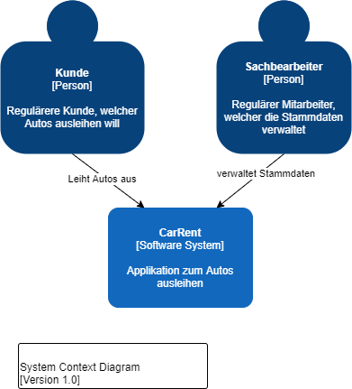
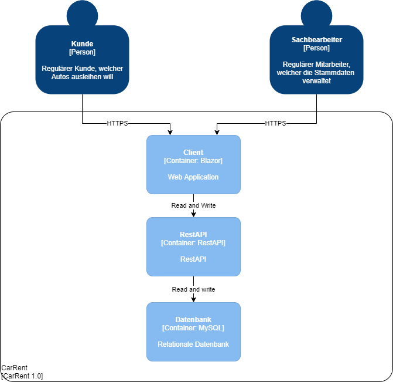
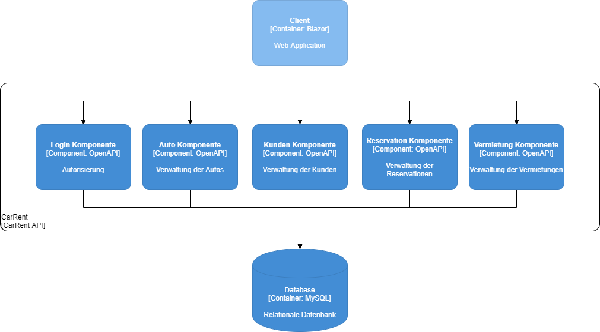
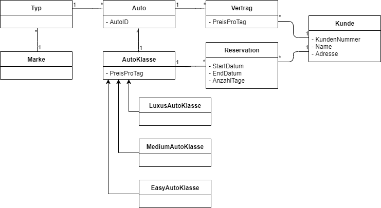
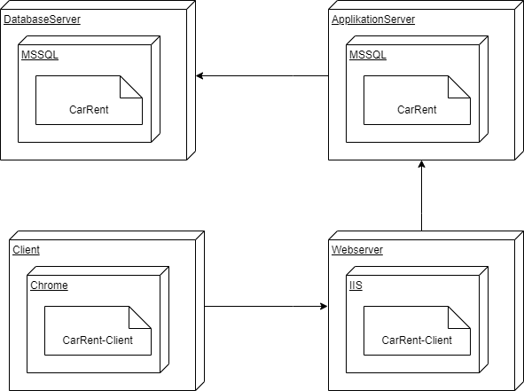
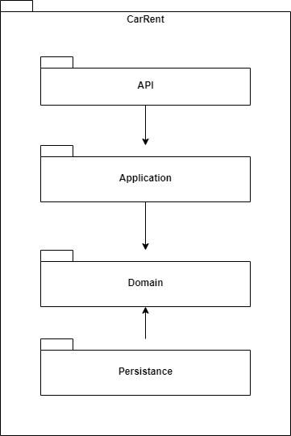

# My Diagrams

## Requirements Overview
### Use Cases
-	Der Sachbearbeiter kann Kunden mit Namen und Adresse und Kundennummer im System verwalten, d.h. erfassen, bearbeiten, löschen und den Kunden mit dessen Namen oder Kundennummer suchen.
-	Der Sachbearbeiter kann zudem die Autos von CarRent verwalten und nach denen suchen.
-	Jedes Auto kann einer bestimmten Klasse zwischen Luxusklasse, Mittelklasse oder Einfachklasse zugeordnet werden und besitzt zudem eine Marke, einen Typ und eine eindeutige Identifikation.
-	Jede Klasse besitzt eine Tagesgebühr.
-	Bei einer neuen Reservation kann der Kunde ein Auto aus einer bestimmten Klasse wählen. Er muss zudem die Anzahl der Tage angeben, die er das Auto gerne mieten möchte. Dabei werden die Gesamtkosten berechnet. Wird die Reservation gespeichert, so wird sie mit einer Reservationsnummer ablegt.
-	Bei Abholung des Autos wird die Reservation in einen Mietvertrag umgewandelt.

## System Scope and Context
### C4-Context

### C4-Containers

### C4-Components

## Domainmodel

## Deployment View
### Deployment Diagram

## Logical View
### Component Diagram

### Class Diagram

## Testing & Metrics
Leider funktioniert dieser Teil bisher noch nicht und ich konnte leider nicht herausfinden, was ich ändern muss. Gemäss den Fehlermeldungen hat er Probleme mit einzelnen NuGet-Packeges, mein Verdacht liegt zurzeit aber eher am .Net Framework. Theoretisch könnte es auch mit der Verwendung von Blazer zusammenhängen, jedoch konnte ich nach längerem Testen keine Lösung finden.
### Continuous Integration
Die Continuous Integration wird mit GitHub Actions realisiert. Nach jedem Commit sollte ein neuer Build-Prozess gestartet werden.

### Testing
Das Testing wird in einem eigenen Projekt gelöst. Alle Tests sollten während dem Build-Prozess automatisch ausgeführt werden. Das Ergebnis der Tests sollte in GitHub eingesehen werden können.

### Metrics
Für die Metriken und Messung der Software wird Sonarcloud eingesetzt. Die GitHub Actions sind mit Sonarcloud verbunden. Nach dem Build-Prozess sollte Sonarcloud das Projekt scannen und Auskunft über die festgelegten Metriken geben.
